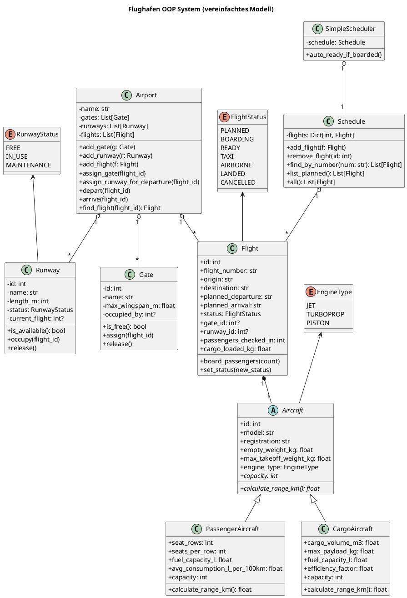

# OOP-Vortrag von Linus und Fynn-Lasse

---

## Aufgaben

1. Beispielaufgabe 1
   >Hier steht etwas über die Aufgabe
3. Beispielaufgabe 2
   >Hier steht etwas über die Aufgabe

---

## Klassendiagramm (PlantUML)

Das folgende PlantUML-Diagramm zeigt die Beziehungen. Kopiere den Code z.B. nach https://www.plantuml.com/plantuml/ oder verwende ein lokales PlantUML-Tool.

### Legende / Beziehungen
- A o-- B: Komposition (A besitzt B, aber Lebenszyklus kann relativ unabhängig sein)
- A *-- B: Stärkere Besitz-Beziehung (hier symbolisch für "hat genau eins")
- Vererbung: Pfeil mit leerer Spitze (z.B. PassengerAircraft erbt von Aircraft)
- Enums werden von Klassen referenziert (Abhängigkeit)

### Wichtige OOP-Konzepte im Diagramm
- Abstraktion: Aircraft ist abstrakt (abstrakte Methoden)
- Vererbung: PassengerAircraft, CargoAircraft
- Polymorphie: Nutzung über den gemeinsamen Typ Aircraft
- Komposition: Airport verwaltet Gates, Runways, Flights
- Kapselung: Methoden sorgen für Zustandsänderungen (assign_gate, board_passengers)

